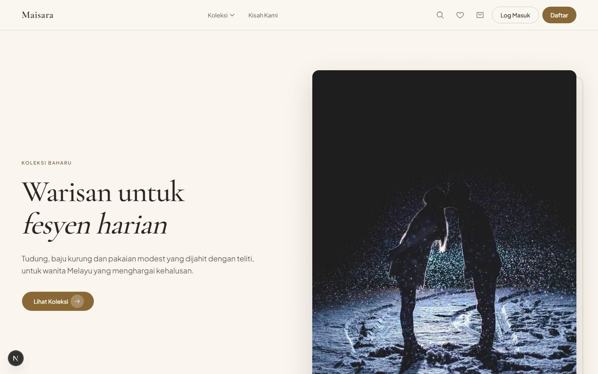
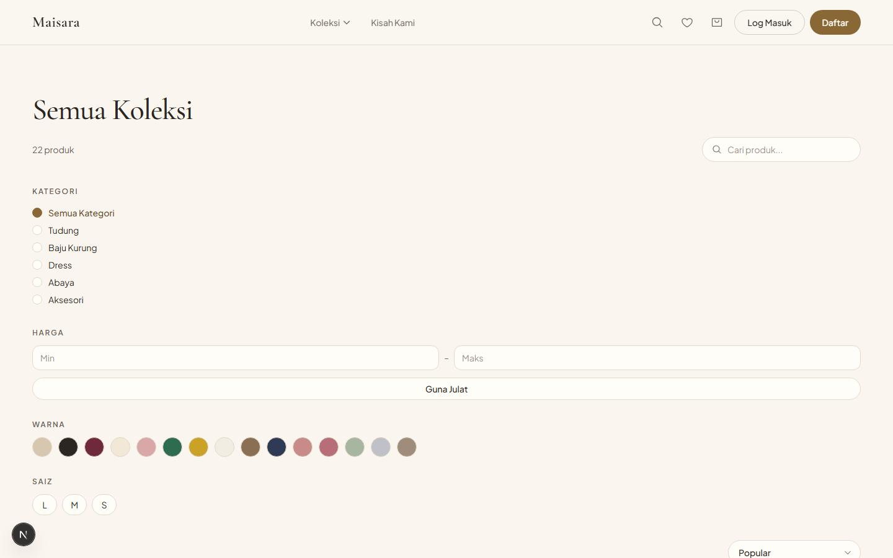
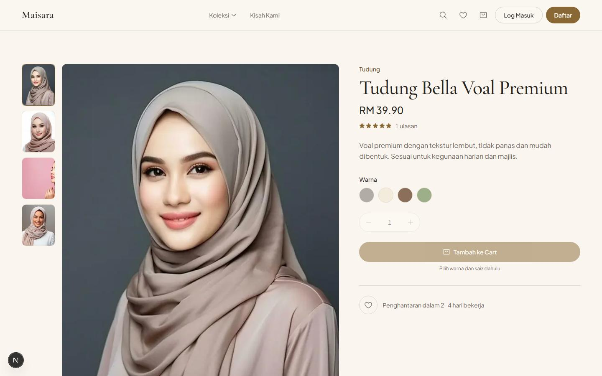

# Maisara

### Butik Modest Fashion — E-Commerce

**Soft-luxury heritage fashion store, built for the Malaysian market.**

Next.js 16 · React 19 · Tailwind v4 · PostgreSQL · Better Auth · Prisma 7

[🌐 Live Demo](https://maisara-beta.vercel.app) · [🛠 Admin Demo](https://maisara-beta.vercel.app/admin)

---

## Tentang Projek

Maisara ialah platform e-commerce lengkap untuk butik modest fashion — brand fiksyen yang dibina sebagai portfolio showcase. Dari katalog dan cart sehingga checkout, akaun pengguna dan admin panel, semuanya berfungsi sebagai satu sistem penuh.

**Konsep:** warisan Melayu (batik/songket) bertemu soft-luxury moden — palet krim dan emas, tipografi serif elegan, dan motif halus yang konsisten di seluruh pengalaman.

---

## Skrin

| Homepage | Katalog | Produk |
|---|---|---|
|  |  |  |

---

## Ciri-ciri

**Untuk Pelanggan**
- Homepage editorial: hero, kategori, produk pilihan, testimoni, kisah jenama
- Katalog dengan carian, penapis (kategori, harga, warna, saiz) dan susunan
- Halaman produk: galeri imej, pemilih variant (warna/saiz), status stok
- Cart pintar (tetamu + pengguna berdaftar, digabung selepas log masuk)
- Checkout 3 langkah: alamat → penghantaran (J&T Express / Pos Laju) → semakan & bayar
- Simulasi bayaran FPX (mock, tiada caj sebenar) — sedia untuk integrasi gateway sebenar
- Akaun: profil, sejarah pesanan + status, wishlist
- Ulasan produk (selepas pesanan selesai, disederhanakan admin)

**Untuk Admin**
- Dashboard: jualan, pesanan terkini, amaran stok rendah
- Pengurusan produk lengkap: CRUD + variant + stok
- Pengurusan pesanan dengan validasi peralihan status (stok dipulangkan bila dibatalkan)
- Penjejakan stok (amaran stok rendah)
- Moderasi ulasan

---

## Tech Stack

| Lapisan | Teknologi |
|---|---|
| Frontend | Next.js 16 (App Router) · React 19 · TypeScript strict |
| Styling | Tailwind CSS v4 · shadcn/ui · Cormorant Garamond + Plus Jakarta Sans |
| Animasi | motion/react (Framer Motion) |
| Auth | Better Auth (email/password, peranan customer/admin) |
| Database | PostgreSQL (Supabase) · Prisma 7 |
| Validasi | Zod 4 |
| Testing | Vitest (unit) · Playwright (E2E) |
| Deploy | Vercel |

---

## Demo Accounts

| Peranan | Emel | Kata Laluan |
|---|---|---|
| Admin | `admin@maisara.my` | `AdminDemo123!` |
| Pelanggan | `nurul@maisara.my` | `Demo123!` |
| Pelanggan | `aina@maisara.my` | `Demo123!` |

> **Nota:** Semua pembayaran adalah simulasi (mode mock) — tiada wang sebenar atau kad kredit terlibat.

---

Dibina dengan **Next.js 16** · **TypeScript** · **Tailwind v4** · Deployed on **Vercel**

